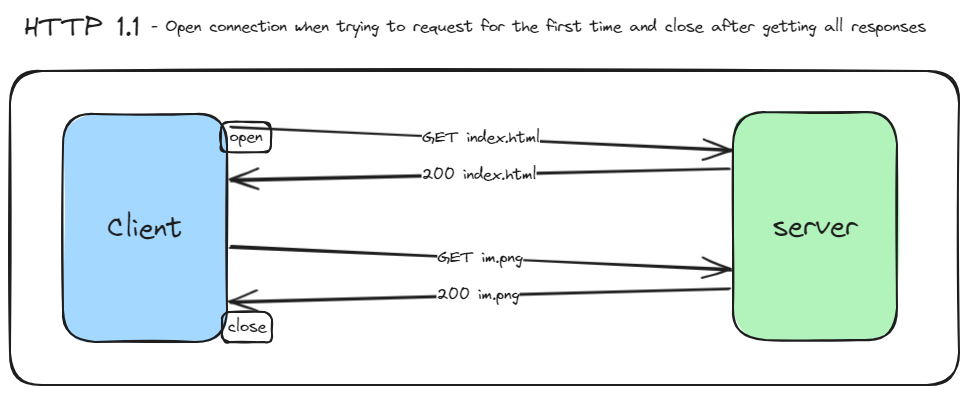

# WebSockets
Very simple demo of websockets with Node.js.

This repository contains a WebSockets demo that showcases the usage of WebSockets for real-time communication between clients and servers. In this README, we'll briefly explain the HTTP/1.0 and HTTP/1.1 protocols and how WebSockets are based on the HTTP/1.1 protocol.

## HTTP/1.0 and HTTP/1.1

HTTP (Hypertext Transfer Protocol) is a protocol that allows clients and servers to communicate over the internet. There are two main versions of the HTTP protocol: HTTP/1.0 and HTTP/1.1.

HTTP/1.0 is the first version of HTTP. It supports basic request and response communication between clients and servers. However, each request/response cycle requires establishing a new connection, which can be inefficient.

HTTP/1.1 is an updated version of HTTP that introduced several improvements. It added features like persistent connections, pipelining, and chunked transfer encoding. These enhancements improved performance and reduced latency. With HTTP/1.1, multiple requests can be sent over a single connection, making communication more efficient.

## WebSockets

WebSockets is a communication protocol that is built on top of the HTTP/1.1 protocol. It enables full-duplex communication between clients and servers over a single, long-lived connection. Unlike HTTP, which is a request/response protocol, WebSockets allow for real-time, bidirectional communication.

WebSockets leverage the features of HTTP/1.1, such as persistent connections, to establish and maintain a connection between the client and server. This connection stays open for the duration of the communication, allowing for instant updates and live data streaming.

## Diagrams

To help you visualize the differences between HTTP/1.0 and HTTP/1.1, I have included two diagrams:

These diagrams illustrate the key features and improvements introduced in HTTP/1.1 compared to HTTP/1.0.

Feel free to explore the demo code to see how WebSockets are implemented and how they leverage the HTTP/1.1 protocol for efficient and real-time communication.

